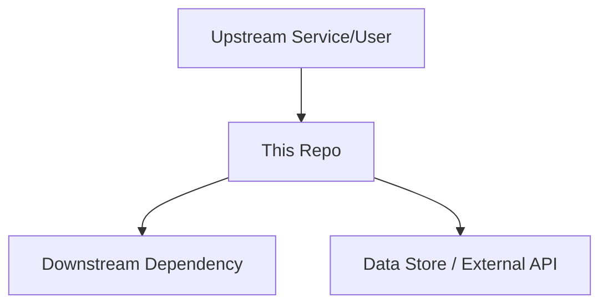

# ARCHITECTURE.md — File Format Reference

`ARCHITECTURE.md` is the "understanding this system" document. It captures how the service is structured internally, how it integrates into the wider system, and the operational knowledge needed to run it.

## Sections (in order)

### 1. Overview

What this system is and its primary responsibility. 2-3 sentences.

### 2. System Context

Where this service fits in the broader system. For services: upstream callers, downstream dependencies, data stores. For libraries/SDKs: who consumes it and what it wraps.

Include a mermaid diagram if the system has meaningful integration points:

### 3. Internal Structure

Package/module breakdown with purpose of each. For monorepos: table of packages. For single-package repos: directory breakdown.

| Directory/Package | Purpose          |
| ----------------- | ---------------- |
| `<path>`          | `<what it does>` |

### 4. Data Flow

Primary data paths through the system. How does data enter, get processed, and exit? Step-by-step numbered sequences for the main operations.

**Rules:**

- Flows sourced from static analysis (routes, handlers, infra wiring) are stated as fact
- Flows that are partially inferred are labeled `[INFERRED]` and listed under "Needs confirmation"
- Include: happy path, error path, async/background processing if applicable

### 5. Domain Concepts

Business entities, their states, lifecycle, and invariants. This section captures knowledge that lives in people's heads, not in code.

**Format per concept:**

- **Name** — what it is
- **States** — valid states and transitions
- **Invariants** — rules that must always hold
- **Gotchas** — non-obvious behavior or edge cases

### 6. Key Dependencies

External services, data stores, queues, APIs. For each:

- What it is and how this service uses it
- Connection details (table names, queue names, env vars)
- What happens if it's unavailable

### 7. Configuration

Environment variables, feature flags, key settings:

| Variable / Flag | Purpose              | Default     |
| --------------- | -------------------- | ----------- |
| `<name>`        | `<what it controls>` | `<default>` |

### 8. Operational Knowledge

Failure modes, alerts, dashboards, deploy/rollback procedures.

**Sub-sections:**

- **Deployment** — how to deploy, rollback, feature flag workflow
- **Failure Modes** — known ways this service breaks and what to do
- **Monitoring** — which dashboards and alerts matter
- **Incident Playbook** — first-responder steps for common failures

## Ownership

Human-authored content is never overwritten. Once the team reviews and merges a generated ARCHITECTURE.md, it becomes team-owned — no special markers needed.
